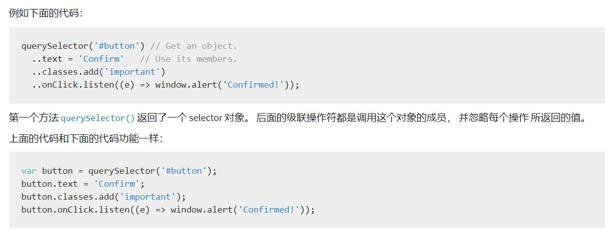

# dart基础语法

可使用 `//` 和 `/**/`、`///` 实现单行注释和多行注释、文档注释。

dart 代码在运行前会被解析一遍。指定数据类型和编译时的常量，可以提高运行速度。

dart 有统一的程序入口：`main()`。

dart 每句代码后必须有 `;` 结束，否则报错。

## 数据类型（5种）

数字类型：int/double

数字转字符串：调用 `.toString()`；字符串转数字：调用 `int/double.parse(str)`；

``` dart
int a = 10;
print(a.toString());

String b = '10';
print(int.parse(b));

double c = 1.23;
print(c.toString());

String d = '1.23';
print(double.parse(d));

String e = '1.2189de6gt';
print(double.parse(e)); // Error，字符串转数字，字符串只能是数字字符串

print(1.323.toStringAsFixed(2)); // double -> String，并且四舍五入
```

字符串类型：String

可使用单引号/双引号创建字符串，使用 `$arg_name` 在字符串中插入变量，也可以通过 `+` 实现字符串连接。也可以使用前缀 `r` 来创建原始字符，避免字符转义。

``` dart
String hello = 'hello', world = "world", str = r'hahah \n dede';
int num = 10;

print('$hello $world, $num');
print(str);
```

布尔类型：true/false

List 集合：数组是 List 对象，多数称之为 List。字面量/构造函数创建。

使用构造函数创建的列表：new List(3)，在创建时就声明其长度。

声明一个列表时，通常会标注什么类型的列表，否则就是 `dynamic` 类型的了： `List<String> list1、List list2`

``` dart
List l = [1, 2, 3];
l.add('de');
l.add(true);
l.add(1);
print(l);  // [1, 2, 3, de, true, 1]
```

Map 字典：字面量/构造函数创建。

``` dart
// 字面量
Map map = {
  'name': 'Jack',
  'age': 20
};

// 构造函数
Map map = new Map();
map['name'] = 'Jack';
map['age'] = 20;
```

像 `List`、`Map` 都是 `iterable` 对象，可使用 `forEach`、`for...in` 实现遍历。 

## 变量

可用 `var、const/final、int/bool/String/double、Object/dynamic` 关键字定义变量。

如果在定义变量时未初始化，则自动赋值为 `null`。

如果一个变量，不想早早的确定其类型，可使用 `Object/dynamic` 关键字。

如果在初始化变量时，未标注其数据类型并且未用 `Object/dynamic` 关键字声明，那么在代码编译时，编译器会根据其值来确定类型。

``` dart
main() {
  var a = 'a'; // 在解析时，a 已被确定为 String 类型
  a = 10;  // Error

  dynamic b = 'b';
  b = 10;  // 10

  // 明确声明类型的变量，更不能被赋值为其他数据类型
  int c = 10;
  c = 'a';  // Error

  String d = 'd';
  print(d);

  bool e = true;
  print(e);
}
```

如果不打算更改一个变量，可用 `final/const` 声明，`final/const` 不能和 `var` 一同使用。

> const 定义的是编译时常量，只能用编译时常量来初始化；
> final 定义的常量可以用变量来初始化

``` dart
final var a = 0; // Error
const var b = 'b'; // Error
```

使用 `final` 声明的变量：

- 变量在声明时必须被初始化。
- 不能被二次赋值。
- 即使可免去标注数据类型，但建议加上。

``` dart
final a; // Error

final b = 'b';
b = 'bb'; // Error

final c = 'c';
final String c = 'c'; // 推荐
```

常量也可以参加运算，将计算结果赋值给新的常量，但是用 `const` 声明的计算结果要求算式中的变量也要是 `const` 声明的：

``` dart
const int a = 2;
const double b = a * 2.3; // 4.6


const int c = 2;
final double d = c * 2.3; // 4.6

final int e = 2;
final double f = e * 2.3; // 4.6

final int g = 2;
const double h = e * 2.3; // Error
```

可用 `final/const` 声明一个变量是一个列表（数组），但是使用 `const []` 声明的则是不可变的空列表。

``` dart
var l1 = [];
l1.add('demo');

const l2 = [];
l2.add(1); // Error

final l3 = [];
l3.add(9.81);

var l4 = const [];
l4.add('demo'); // Error

const l5 = const [];
l5.add('demo'); // Error

final l6 = const [];
l6.add('demo'); // Error
```

此外：`const` 不仅可以声明常量，还能创建常量值、声明创建常量值的构造器。

## 运算符

算术运算符：+ - * / `~/`（除以，返回整数结果） ++ --

比较运算符：> < >= <= == !=

类型测试运算符：is(属于) is!(不属于)

逻辑运算符：&& || !

位运算符：& | ^ ~ << >>

赋值运算符：= /= *= %= += -= %= &= ^= |= ??=（当变量为 null，才被赋值）

条件成员访问：?. A?.b A不为空则返回属性b的值。

是否为空：A??B A 如果为空，则返回B；否则返回A。

三元运算符：? :

级联运算符：`..` 级联操作符 (..) 可以在同一个对象上 连续调用多个函数以及访问成员变量。


