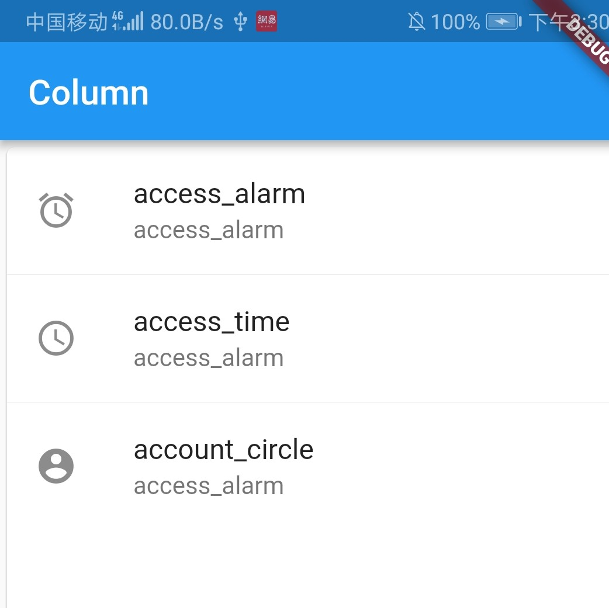

# Card 卡片布局

卡片：四周有弯角，有阴影。

``` dart
import 'package:flutter/material.dart';

void main() => runApp(MyApp());

class MyApp extends StatelessWidget {
  @override
  Widget build(BuildContext context) {
    return MaterialApp(
      title: "GridView",
      home: Scaffold(
        appBar: AppBar(
          title: Text("Column"),
        ),
        body: Center(
          child: MyCard()
        )
      ),
    );
  }
}

class MyCard extends StatelessWidget {
  @override
  Widget build(BuildContext context) {
    return Card(
      child: Column(
        children: <Widget>[
          ListTile(
            leading: Icon(Icons.access_alarm),
            title: Text('access_alarm'),
            subtitle: Text('access_alarm')
          ),
          new Divider(
            height: 1.0
          ),
          ListTile(
            leading: Icon(Icons.access_time),
            title: Text('access_time'),
            subtitle: Text('access_alarm')
          ),
          new Divider(
            height: 1.0
          ),
          ListTile(
            leading: Icon(Icons.account_circle),
            title: Text('account_circle'),
            subtitle: Text('access_alarm')
          )
        ],
      ),
    );
  }
}
```

Card() 组件的child:使用了Column垂直布局, 并使用ListTile()进行填充。

Divider()是分割线，也可以使用color:属性添加颜色。

在ListTile()中使用title:标题加粗，subtitle:副标题和leading:图标。


