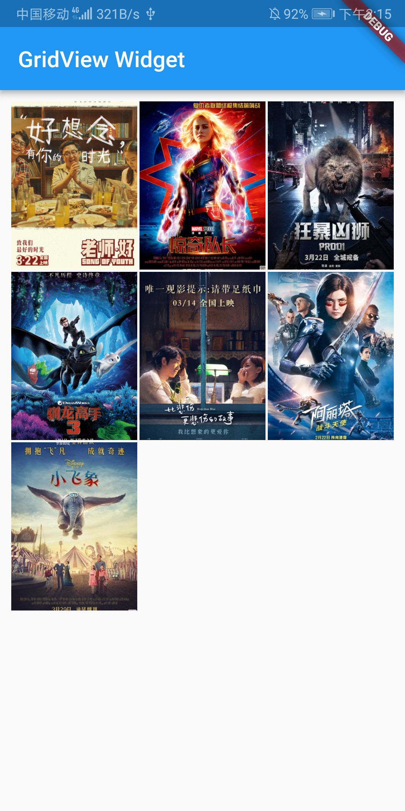

# GridView Widget

网格列表

``` dart
class MyApp extends StatelessWidget {
  @override
  Widget build(BuildContext context) {
    return MaterialApp(
      title: "GridView",
      home: Scaffold(
        appBar: AppBar(
          title: Text("GridView Widget"),
        ),
        body: GridView.count(
          crossAxisCount: 3,
          padding: EdgeInsets.all(10.0),
          crossAxisSpacing: 10.0,
          children: <Widget>[
            const Text("this is 1 item"),
            const Text("this is 2 item"),
            const Text("this is 3 item"),
            const Text("this is 4 item"),
            const Text("this is 5 item"),
          ],
        ),
      ),
    );
  }
}
```

使用GridView.count()方法创建GridView组件，也可直接使用GridView创建网格组件：
- crossAxisCount：每行显示的网格个数
- childAspectRatio: 表示宽高比，即宽是高的多少倍，0.75=3/4
- mainAxisSpacing: 行间距
- crossAxisSpacing：列间距。

``` dart
import 'package:flutter/material.dart';

void main() => runApp(MyApp());

class MyApp extends StatelessWidget {
  @override
  Widget build(BuildContext context) {
    return MaterialApp(
      title: "GridView",
      home: Scaffold(
        appBar: AppBar(
          title: Text("GridView Widget"),
        ),
        body: GridView(
          padding: EdgeInsets.all(10.0),
          gridDelegate: SliverGridDelegateWithFixedCrossAxisCount(
            crossAxisCount: 3,
            mainAxisSpacing: 2.0,
            crossAxisSpacing: 2.0,
            childAspectRatio: 0.75
          ),
          children: <Widget>[
            // const Text("this is 1 item"),
            // const Text("this is 2 item"),
            // const Text("this is 3 item"),
            // const Text("this is 4 item"),
            // const Text("this is 5 item"),
            Image.network(
                "http://img5.mtime.cn/mt/2019/02/21/095918.47882172_270X405X4.jpg",
                fit: BoxFit.cover
              ),
              Image.network(
                "http://img5.mtime.cn/mt/2019/01/25/100901.82440600_270X405X4.jpg",
                fit: BoxFit.cover
              ),
              Image.network(
                "http://img5.mtime.cn/mg/2019/02/19/095714.33859824_270X405X4.jpg",
                fit: BoxFit.cover
              ),
              Image.network(
                "http://img5.mtime.cn/mt/2019/01/25/105549.53627008_270X405X4.jpg",
                fit: BoxFit.cover
              ),
              Image.network(
                "http://img5.mtime.cn/mt/2019/03/01/142658.85498591_270X405X4.jpg",
                fit: BoxFit.cover
              ),
              Image.network(
                "http://img5.mtime.cn/mt/2019/01/09/171109.88229500_270X405X4.jpg",
                fit: BoxFit.cover
              ),
              Image.network(
                "http://img5.mtime.cn/mg/2019/02/26/103754.10526344_270X405X4.jpg",
                fit: BoxFit.cover
              )
          ],
        ),
      ),
    );
  }
}
```


