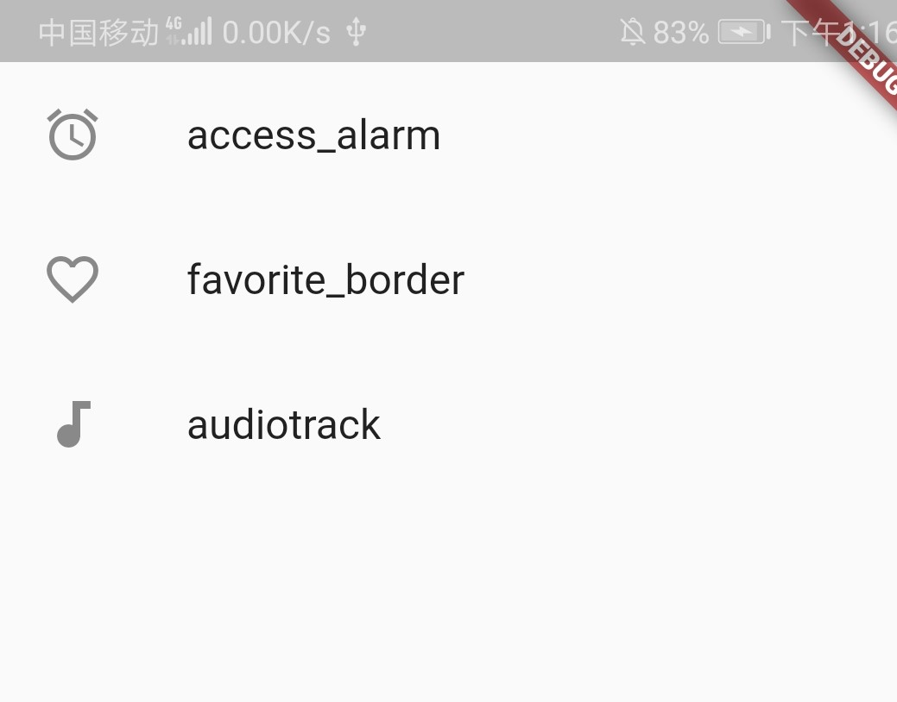

# ListView Widget

列表组件 ListView

``` dart
body: ListView(
  children: <Widget>[
    ListTile(
      leading: Icon(Icons.access_alarm),
      title: Text("access_alarm"),
    ),
    ListTile(
      leading: Icon(Icons.favorite_border),
      title: Text("favorite_border"),
    ),
    ListTile(
      leading: Icon(Icons.audiotrack),
      title: Text("audiotrack"),
    ),
  ],
),
```

在 ListView 的children 属性时一个泛型为Widget的数组，我们使用ListTile进行填充。ListTile由图标和文字组成：



也可以使用图片代替 Icon:

``` dart
body: ListView(
  children: <Widget>[
    Image.network("https://www.qq745.com/uploads/allimg/170416/17-1F4161H131Y9-lp.png"),
    Image.network("http://ww1.sinaimg.cn/thumb180/006am4TEgw1f3x8tq1gqrj31480qo7js.jpg"),
    Image.network("https://www.qq745.com/uploads/allimg/150907/2221003F2-0-lp.jpg"),
    Image.network("http://ww2.sinaimg.cn/thumb180/0066fqovgw1f75tu2nxhfj30ku0dvjtq.jpg"),
    Image.network("http://p5.sinaimg.cn/2782984404/180/14791407463112"),
  ]
),
```


### ScrollDirection

ScrollDirection 属性能改变列表方向

scrollDirection属性只有两个值，一个是横向滚动，一个是纵向滚动。默认的就是垂直滚动，所以如果是垂直滚动，我们一般都不进行设置。

Axis.horizontal: 横向滚动或者叫水平方向滚动。
Axis.vertical: 纵向滚动或者叫垂直方向滚动。

``` dart
body: ListView(
  scrollDirection: Axis.vertical,  // 改为竖直方向
  children: <Widget>[
    Image.network("https://www.qq745.com/uploads/allimg/170416/17-1F4161H131Y9-lp.png"),
    Image.network("http://ww1.sinaimg.cn/thumb180/006am4TEgw1f3x8tq1gqrj31480qo7js.jpg"),
    Image.network("https://www.qq745.com/uploads/allimg/150907/2221003F2-0-lp.jpg"),
    Image.network("http://ww2.sinaimg.cn/thumb180/0066fqovgw1f75tu2nxhfj30ku0dvjtq.jpg"),
    Image.network("http://p5.sinaimg.cn/2782984404/180/14791407463112"),
  ],
),
```

也可以设置 Container 列表：

``` dart
home: Scaffold(
  body: Center(
    child: Container(
      height: 600.0,
      color: Colors.blue,
      child: ListView(
        scrollDirection: Axis.horizontal,
        children: <Widget>[
          new Container(
            width:180.0,
            color: Colors.lightBlue,
          ),
          new Container(
            width:180.0,
            color: Colors.amber,
          ),
          new Container(
            width:180.0,
            color: Colors.deepOrange,
          ),
          new Container(
            width:180.0,
            color: Colors.deepPurpleAccent,
          )
        ],
      )
    )
  ),
)
```

把 list 列表抽出来作为一个类展示：

``` dart
import 'package:flutter/material.dart';

void main() => runApp(MyApp());

class MyApp extends StatelessWidget {
  @override
  Widget build(BuildContext context) {
    return MaterialApp(
      title: 'Text widget',
      home: Scaffold(
        body: Center(
          child: Container(
            height: 600.0,
            color: Colors.blue,
            child: MyList()
          )
        ),
      )
    );
  }
}

class MyList extends StatelessWidget {
  @override
  Widget build(BuildContext context) {
    return ListView(
      scrollDirection: Axis.horizontal,
      children: <Widget>[
        new Container(
          width:180.0,
          color: Colors.lightBlue,
        ),
        new Container(
          width:180.0,
          color: Colors.amber,
        ),
        new Container(
          width:180.0,
          color: Colors.deepOrange,
        ),
        new Container(
          width:180.0,
          color: Colors.deepPurpleAccent,
        )
      ],
    );
  }
} 
```

### 动态列表

思想：使用动态生成的 List 填充列表，使用 ListView.builder() 方法展示

MyApp({Key key, @required this.items}) : super(key: key);
@required是必传参数。: super 如果父类没有无名无参数的默认构造函数，则子类必须手动调用一个父类构造函数。

``` dart
import 'package:flutter/material.dart';

void main() => runApp(MyApp(
  items: List<String>.generate(100, (index) => 'Item$index')
));

class MyApp extends StatelessWidget {
  final List <String> items;

  MyApp({Key key, @required this.items}) : super(key: key);

  @override
  Widget build(BuildContext context) {
    return MaterialApp(
      title: 'Text widget',
      home: Scaffold(
        body: ListView.builder(
          itemCount: items.length,
          itemBuilder: (context, index) {
            return ListTile(
              title: Text("${items[index]}"),
            );
          }),
      )
    );
  }
}
```


