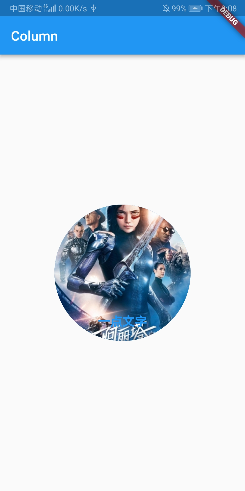
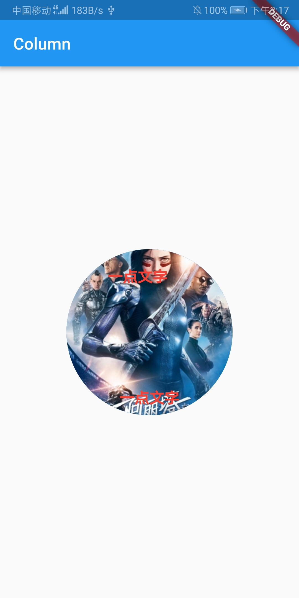

# 层叠布局

例如：一张原型图片上添加一行文字。使用Row Widget或者Column Widget是实现不了的，这时就需要使用Stack Widget。

``` dart
import 'package:flutter/material.dart';

void main() => runApp(MyApp());

class MyApp extends StatelessWidget {
  @override
  Widget build(BuildContext context) {
    return MaterialApp(
      title: "GridView",
      home: Scaffold(
        appBar: AppBar(
          title: Text("Column"),
        ),
        body: Center(
          child: MyStack()
        )
      ),
    );
  }
}

class MyStack extends StatelessWidget {
  @override
  Widget build(BuildContext context) {
    return Stack(
      children: <Widget>[
        CircleAvatar(
          backgroundImage: NetworkImage(
            'http://img5.mtime.cn/mt/2019/01/09/171109.88229500_270X405X4.jpg'
          ),
          radius: 100.0,
        ),
        Container(
          child: Text(
            '一点文字', 
            style: TextStyle(
              fontSize: 18.0,
              fontWeight: FontWeight.w700,
              color: Colors.blue
            )
          )
        )
      ],
      alignment: const FractionalOffset(0.5, 0.9),  // 定位
    );
  }
}
```



### CircleAvatar组件

CircleAvatar 组件经常用来作头像控件，组件里边有个radius的值可以设置图片的弧度。
现在我们准备放入一个图像，然后把弧度设置成100，形成一个漂亮的圆形，

### alignment 属性

alignment: const FractionalOffset(0.5, 0.9),
alignment 属性是控制层叠的位置的，建议在 `两个内容进行层叠时` 使用。它有两个值X轴距离和Y轴距离，值是从0到1的，都是从上层容器的左上角开始算起的。

### Positioned属性

如果超过两个组件的层叠，alignment 属性就满足不了需求了，需要使用 Positioned 属性。所以这个组件也叫做 `层叠定位组件`。

- bottom: 距离层叠组件下边的距离
- left：距离层叠组件左边的距离
- top：距离层叠组件上边的距离
- right：距离层叠组件右边的距离
- width: 层叠定位组件的宽度
- height: 层叠定位组件的高度

``` dart
import 'package:flutter/material.dart';

void main() => runApp(MyApp());

class MyApp extends StatelessWidget {
  @override
  Widget build(BuildContext context) {
    return MaterialApp(
      title: "GridView",
      home: Scaffold(
        appBar: AppBar(
          title: Text("Column"),
        ),
        body: Center(
          child: MyStack()
        )
      ),
    );
  }
}

class MyStack extends StatelessWidget {
  @override
  Widget build(BuildContext context) {
    return Stack(
      children: <Widget>[
        CircleAvatar(
          backgroundImage: NetworkImage(
            'http://img5.mtime.cn/mt/2019/01/09/171109.88229500_270X405X4.jpg'
          ),
          radius: 100.0,
        ),
        Positioned(
          top: 20.0,
          left: 50.0,
          child: Text(
            '一点文字', 
            style: TextStyle(
              fontSize: 18.0,
              fontWeight: FontWeight.w700,
              color: Colors.red
            )
          )
        ),
        Positioned(
          bottom: 10.0,
          child: Text(
            '一点文字', 
            style: TextStyle(
              fontSize: 18.0,
              fontWeight: FontWeight.w700,
              color: Colors.red
            )
          )
        )
      ],
      alignment: const FractionalOffset(0.5, 0.9),  // 定位
    );
  }
}
```


