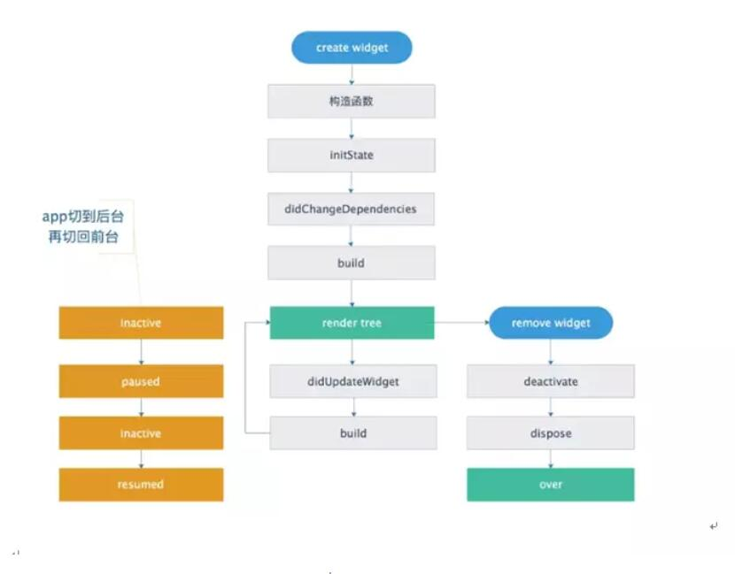

# StatefulWidget

在 Flutter 中声明一个 widget 是一个有状态的 widget，主要作用：为 widget 提供状态，状态改变 => 更新 UI。示例如下：

``` dart
import 'package:flutter/material.dart';

class MyApp extends StatefulWidget {

  final String content;
  MyApp(this.content);

  @override
  _MyAppState createState() => _MyAppState();
}

class _MyAppState extends State<MyApp> {

  bool isShowText = true;

  @override
  Widget build(BuildContext context) {
    return Container(
      child: isShowText ? Text(widget.content) : null,
    );
  }
}
```

### 为什么 StatefulWidget 会被分成 StatefulWidget 和 State 两部分？

- 为了保存当前 APP 的状态。因为当 UI 更新时，如果StatefulWidget 不分成两部分，StatefulWidget 重建 => 数据消失。如果分成两部分，StatefulWidget 重建 => StatefulWidget 重建 && State 不会重建，从而保存了当前 APP 的状态。
- 考虑 widget 重建的性能。StatefulWidget 分成两部分后，StatefulWidget 会被重建并且成本低，而 State 重建成本高且不会被重建。

### 上述实例中 State 内的成员变量

1. 通过 widget.content 可以实现：在 State 中访问 StatefulWidget 中的变量。
2. State 中的 context，当前 widget 树的上下文。
3. mounted 判断当前 State 是否加载到树中。未加载到树中时，通过 `setState` 修改局部状态是会报异常的，保险的写法是：
    ``` dart
    if (mounted) {
      setState(() {
        ...
      });
    }
    ```

### StatefulWidget 生命周期



create widget: 创建 State 的过程
- 调用构造函数
- initState: 初始化 StatefulWidget 内部状态，一旦 initState() 完成，State 对象即可使用，BuildContext 也能使用。因此可以在此钩子内执行：依赖于 BuildContext 或 Widget 的初始化、animations/controllers 的初始化、绑定控制器。
- didChangeDependencies 此方法被调用的时机：initState 后、widget 依赖的数据被调用、链接到 InheriedWidget，每次重建此窗口小部件时。
- build: 当前 StatefulWidget 创建完成。

render tree: 渲染 widget 树过程：
- didUpdateWidget: State 内部状态发生改变时触发。
- build: 状态改变，State 会重新 build。

remove widget: 当 State 从树中移除时的过程：
- deactive: 当前 State 部件失活。
- dispose: 执行清理工作，例如去除侦听器 Controller

app 切换到后台执行的钩子：
- inactive
- paused

app 切换到前台执行的钩子：
- inactive
- resumed

实例：

``` dart
class _LifeDemoState extends State<LifeDemo>
         with WidgetsBindingObserver {

  @override
  void initState() {
    // TODO: implement initState
    super.initState();

     // 使用 didChangeAppLifecycleState 需要实现抽象类 WidgetsBindingObserver
    WidgetsBinding.instance.addObserver(this);
    print('initState');
  }

  @override
  void didChangeAppLifecycleState(AppLifecycleState state) {
    print(state.toString());
  }

  @override
  void didChangeDependencies() {
    // TODO: implement didChangeDependencies
    super.didChangeDependencies();
    print('didChangeDependencies');
  }

  @override
  void didUpdateWidget(LifeDemo oldWidget) {
    // TODO: implement didUpdateWidget
    super.didUpdateWidget(oldWidget);
    print('didUpdateWidget');
  }

  @override
  Widget build(BuildContext context) {
    print('build');
    // TODO: implement build
    return MaterialApp(
      home: Center(
        child: GestureDetector(
          child: Text('lifeCycle'),
          onTap: () {
            Navigator.of(context).push(MaterialPageRoute(
              builder: (BuildContext c) {
                return Text('sdfs');
              })
            );
          },
        )
      ),
    );
  }
  @override
  void reassemble() {
    // TODO: implement reassemble
    super.reassemble();
    print('reassemble');
  }
  @override
  void deactivate() {
    // TODO: implement deactivate
    super.deactivate();
    print('deactivate');
  }
  
  @override
  void dispose() {
    // TODO: implement dispose
    super.dispose();
    WidgetsBinding.instance.addObserver(this);
    print('dispose');
  }
}
```

学习链接：[flutter State 的生命周期](https://www.jianshu.com/p/f39cf2f7ad78)
