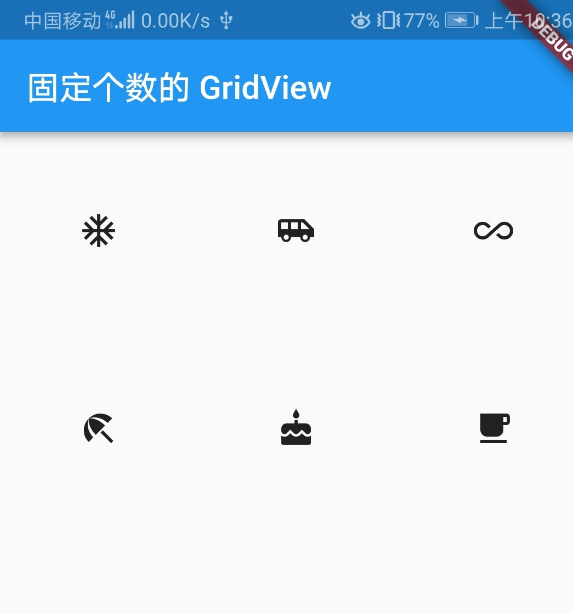
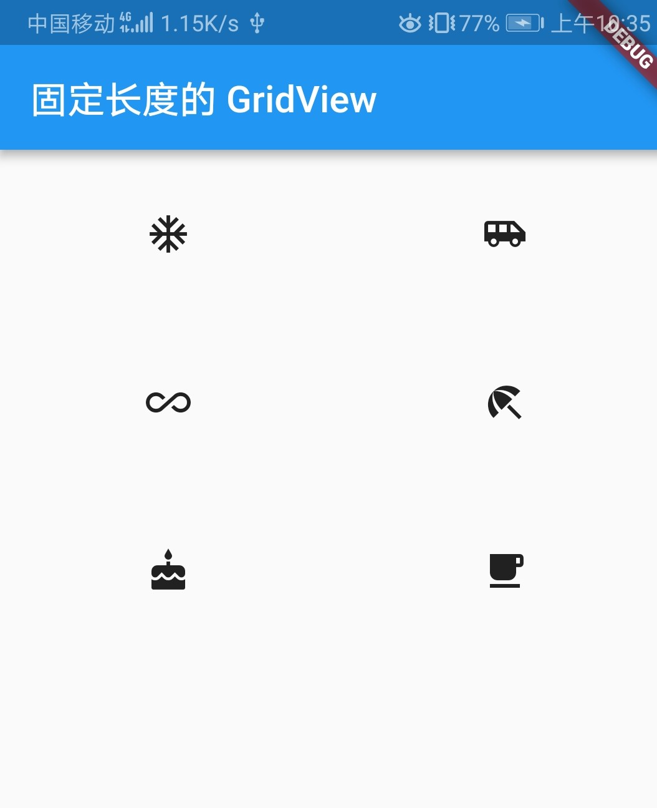
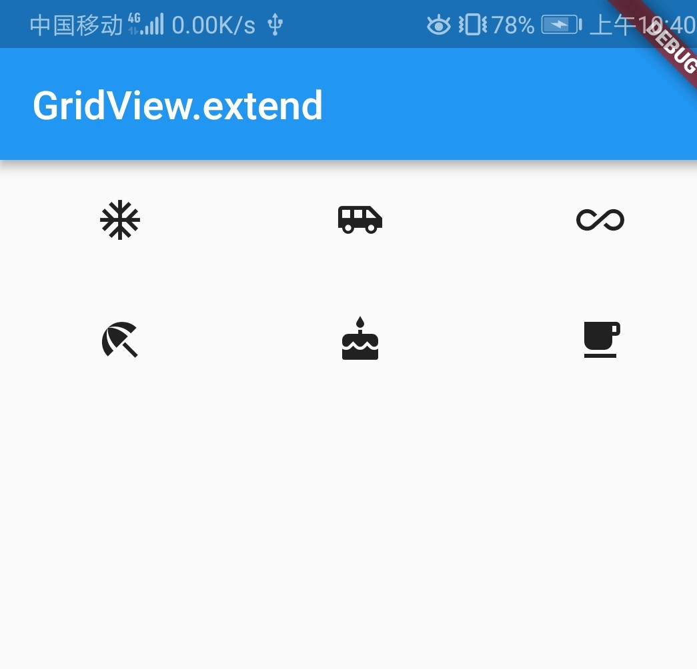

### 网格列表 GridView Widget

GridView 可以构建一个二维网格列表，其默认构造函数定义如下：

``` dart
GridView({
  Axis scrollDirection = Axis.vertical,
  bool reverse = false,
  ScrollController controller,
  bool primary,
  ScrollPhysics physics,
  bool shrinkWrap = false,
  bool addAutomaticKeepAlives = true,
  bool addRepaintBoundaries = true,
  double cacheExtent,
  List<Widget> children = const <Widget>[],

  EdgeInsetsGeometry padding,
  @required SliverGridDelegate gridDelegate, 
  /* 
    控制子 widgets 的布局Flutter中提供了两个SliverGridDelegate的子类 :
      SliverGridDelegateWithFixedCrossAxisCount
      SliverGridDelegateWithMaxCrossAxisExtent
  */
})
```

### SliverGridDelegateWithFixedCrossAxisCount 固定数量子元素

该子类实现了一个横轴为固定数量子元素的布局算法，其构造函数为：

``` dart
SliverGridDelegateWithFixedCrossAxisCount({
  @required double crossAxisCount, 
  /*
    横轴子元素的数量。此属性值确定后子元素在横轴的长度就确定了,即ViewPort横轴长度/crossAxisCount。
  */
  double mainAxisSpacing = 0.0,
  /*
    主轴方向的间距。
  */
  double crossAxisSpacing = 0.0,
  /*
    横轴方向子元素的间距。
  */
  double childAspectRatio = 1.0,
  /*
    表示宽高比，即宽是高的多少倍，0.75=3/4
  */
})
```

``` dart
GridView(
  gridDelegate: SliverGridDelegateWithFixedCrossAxisCount(
    crossAxisCount: 3, //横轴三个子widget
    childAspectRatio: 1.0 //宽高比为1时，子widget
  ),
  children:<Widget>[
    Icon(Icons.ac_unit),
    Icon(Icons.airport_shuttle),
    Icon(Icons.all_inclusive),
    Icon(Icons.beach_access),
    Icon(Icons.cake),
    Icon(Icons.free_breakfast)
  ]
)
```



### SliverGridDelegateWithMaxCrossAxisExtent 固定最大长度

该子类实现了一个横轴子元素为固定最大长度的layout算法，根据最大长度的不同，行数和列数略有不同，其构造函数为：

``` dart
SliverGridDelegateWithMaxCrossAxisExtent({
  double maxCrossAxisExtent,
  double mainAxisSpacing = 0.0,
  double crossAxisSpacing = 0.0,
  double childAspectRatio = 1.0,
})
```

``` dart
GridView(
  padding: EdgeInsets.zero,
  gridDelegate: SliverGridDelegateWithMaxCrossAxisExtent(
    maxCrossAxisExtent: 200.0,
    childAspectRatio: 2.0  //宽高比为2
  ),
  children: <Widget>[
    Icon(Icons.ac_unit),
    Icon(Icons.airport_shuttle),
    Icon(Icons.all_inclusive),
    Icon(Icons.beach_access),
    Icon(Icons.cake),
    Icon(Icons.free_breakfast),
  ],
)
```



### GridView.count

GridView.count 构造函数如下：

``` dart
GridView.count({
  Axis scrollDirection: Axis.vertical, 
  bool reverse: false, 
  ScrollController controller, 
  bool primary, 
  ScrollPhysics physics, 
  bool shrinkWrap: false, 
  EdgeInsetsGeometry padding, 
  int crossAxisCount, 
  double mainAxisSpacing: 0.0, 
  double crossAxisSpacing: 0.0, 
  double childAspectRatio: 1.0, 
  bool addAutomaticKeepAlives: true, 
  bool addRepaintBoundaries: true, 
  bool addSemanticIndexes: true, 
  double cacheExtent, 
  List<Widget> children: const <Widget> [], 
  DragStartBehavior dragStartBehavior: DragStartBehavior.down, 

  int semanticChildCount
})
```

GridView.count 构造函数内部使用了 SliverGridDelegateWithFixedCrossAxisCount，使用 GridView.count() 方法创建 GridView 组件，也可直接使用GridView创建网格组件：

``` dart
GridView.count(
  padding: EdgeInsets.all(10.0),
  crossAxisCount: 3,
  mainAxisSpacing: 2.0,
  crossAxisSpacing: 2.0,
  childAspectRatio: 0.75,
  children: <Widget>[
    Image.network(
      "http://img5.mtime.cn/mt/2019/02/21/095918.47882172_270X405X4.jpg",
      fit: BoxFit.cover
    ),
    Image.network(
      "http://img5.mtime.cn/mt/2019/01/25/100901.82440600_270X405X4.jpg",
      fit: BoxFit.cover
    ),
    Image.network(
      "http://img5.mtime.cn/mg/2019/02/19/095714.33859824_270X405X4.jpg",
      fit: BoxFit.cover
    ),
    Image.network(
      "http://img5.mtime.cn/mt/2019/01/25/105549.53627008_270X405X4.jpg",
      fit: BoxFit.cover
    ),
    Image.network(
      "http://img5.mtime.cn/mt/2019/03/01/142658.85498591_270X405X4.jpg",
      fit: BoxFit.cover
    ),
    Image.network(
      "http://img5.mtime.cn/mt/2019/01/09/171109.88229500_270X405X4.jpg",
      fit: BoxFit.cover
    ),
    Image.network(
      "http://img5.mtime.cn/mg/2019/02/26/103754.10526344_270X405X4.jpg",
      fit: BoxFit.cover
    )
  ],
)
```


### GridView.extent

GridView.extent 构造函数如下：

``` dart
GridView.extent({
  Axis scrollDirection: Axis.vertical, 
  bool reverse: false, 
  ScrollController controller, 
  bool primary, 
  ScrollPhysics physics, 
  bool shrinkWrap: false, 
  EdgeInsetsGeometry padding, 
  double mainAxisSpacing: 0.0, 
  double crossAxisSpacing: 0.0, 
  double childAspectRatio: 1.0, 
  bool addAutomaticKeepAlives: true, 
  bool addRepaintBoundaries: true, 
  bool addSemanticIndexes: true, 
  List<Widget> children: const <Widget> [], 
  int semanticChildCount, 
  DragStartBehavior dragStartBehavior: DragStartBehavior.down, 

  double maxCrossAxisExtent
})
```

因为 GridView.extent 内部使用了 SliverGridDelegateWithMaxCrossAxisExtent，我们通过它可以快速的创建纵轴子元素为固定最大长度的的 GridView ，上面的示例代码等价于：

``` dart
GridView.extent(
  maxCrossAxisExtent: 120.0,
  childAspectRatio: 2.0,
  children: <Widget>[
    Icon(Icons.ac_unit),
    Icon(Icons.airport_shuttle),
    Icon(Icons.all_inclusive),
    Icon(Icons.beach_access),
    Icon(Icons.cake),
    Icon(Icons.free_breakfast),
  ],
)
```



### GridView.builder

GridView.count、GridView.extend 都对于固定个数的布局，对于不固定子部件的 GridView，则需要使用 Gridview.builder，其必要参数有：

``` dart
GridView.builder(
 ...
 @required SliverGridDelegate gridDelegate, 
 @required IndexedWidgetBuilder itemBuilder,
)
```

### 其他

我们发现，以上 GridView 布局出来的子部件的大小都是相同的，如果子部件的大小不同，岂不是不能使用 GridView 了？于是就有一个开源包来解决这个问题：[flutter_staggered_grid_view](https://pub.dev/packages/flutter_staggered_grid_view/versions/0.2.1)
