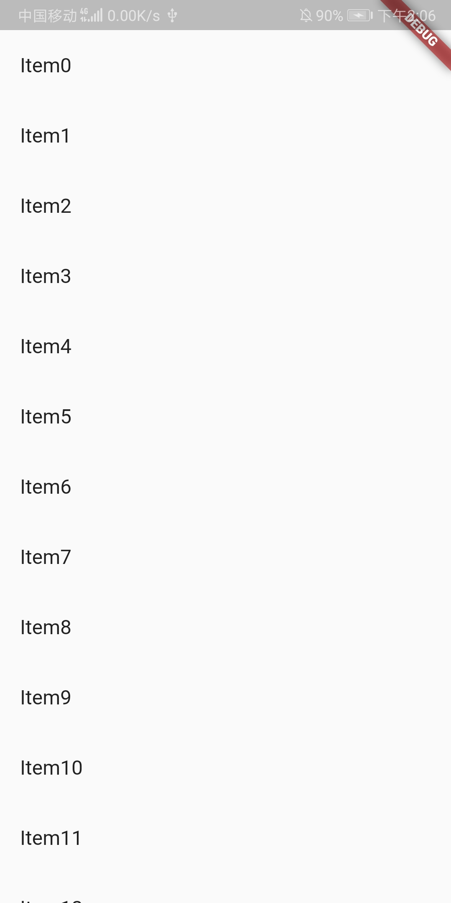

# 长列表部件 ListView Widget

ListView是最常用的可滚动widget，它可以沿一个方向线性排布所有子widget。

``` dart
ListView({
  ...  
  //可滚动widget公共参数
  Axis scrollDirection = Axis.vertical,
  /*
    Axis.horizontal: 横向滚动或者叫水平方向滚动
    Axis.vertical: 纵向滚动或者叫垂直方向滚动
  */
  bool reverse = false,
  ScrollController controller,
  bool primary,
  ScrollPhysics physics,
  EdgeInsetsGeometry padding,

  //ListView各个构造函数的共同参数  
  double itemExtent,
  /*
    该参数如果不为null，则会强制children的"长度"为itemExtent的值；这里的"长度"是指滚动方向上子widget的长度，即如果滚动方向是垂直方向，则itemExtent代表子widget的高度，如果滚动方向为水平方向，则itemExtent代表子widget的长度。
    
    在ListView中，指定 itemExtent 比让子 widget 自己决定自身长度会更高效，这是因为指定 itemExtent 后，滚动系统可以提前知道列表的长度，而不是总是动态去计算，尤其是在滚动位置频繁变化时（滚动系统需要频繁去计算列表高度）。
  */
  bool shrinkWrap = false,
  /*
    是否根据子 widget 的总长度来设置 ListView 的长度，默认值为 false 。默认情况下，ListView 的会在滚动方向尽可能多的占用空间。当 ListView 在一个无边界(滚动方向上)的容器中时，shrinkWrap 必须为 true。
  */
  bool addAutomaticKeepAlives = true,
  /*
    该属性表示是否将列表项（子 widget）包裹在A utomaticKeepAlive widget 中；典型地，在一个懒加载列表中，如果将列表项包裹在 AutomaticKeepAlive 中，在该列表项滑出视口时该列表项不会被 GC，它会使用 KeepAliveNotification 来保存其状态。如果列表项自己维护其 KeepAlive 状态，那么此参数必须置为 false。
  */
  bool addRepaintBoundaries = true,
  /*
    该属性表示是否将列表项（子 widget）包裹在 RepaintBoundary 中。当可滚动 widget滚动时，将列表项包裹在 RepaintBoundary 中可以避免列表项重绘，但是当列表项重绘的开销非常小（如一个颜色块，或者一个较短的文本）时，不添加RepaintBoundary 反而会更高效。和 addAutomaticKeepAlive 一样，如果列表项自己维护其 KeepAlive 状态，那么此参数必须置为 false
  */
  double cacheExtent,

  //子widget列表
  List<Widget> children = const <Widget>[],
})
```

**注意**：ListView 的部分属性其他可滚动 widgets 也具有。

``` dart
body: ListView(
  children: <Widget>[
    ListTile(
      leading: Icon(Icons.access_alarm),
      title: Text("access_alarm"),
    ),
    ListTile(
      leading: Icon(Icons.favorite_border),
      title: Text("favorite_border"),
    ),
    ListTile(
      leading: Icon(Icons.audiotrack),
      title: Text("audiotrack"),
    ),
  ],
),
```

在 ListView 的children 属性时一个泛型为Widget的数组，我们使用ListTile进行填充。ListTile由图标和文字组成：


### 

### ListView.builder

``` dart
ListView.builder({
  // ListView公共参数已省略  
  ...
  @required IndexedWidgetBuilder itemBuilder,
  /*
    列表项的构建器，类型为 IndexedWidgetBuilder，返回值为一个 widget。当列表滚动到具体的 index 位置时，会调用该构建器构建列表项。
  */
  int itemCount,
  /*
    列表项的数量，如果为 null，则为无限列表。
  */
  ...
})
```

思想：使用动态生成的 List 填充列表，使用 ListView.builder() 方法展示

MyApp({Key key, @required this.items}) : super(key: key);
@required是必传参数。: super 如果父类没有无名无参数的默认构造函数，则子类必须手动调用一个父类构造函数。

``` dart
import 'package:flutter/material.dart';

void main() => runApp(MyApp(
  items: List<String>.generate(100, (index) => 'Item$index')
));

class MyApp extends StatelessWidget {
  final List <String> items;

  MyApp({Key key, @required this.items}) : super(key: key);

  @override
  Widget build(BuildContext context) {
    return MaterialApp(
      title: 'Text widget',
      home: Scaffold(
        body: ListView.builder(
          itemCount: items.length,
          itemBuilder: (context, index) {
            return ListTile(
              title: Text("${items[index]}"),
            );
          }),
      )
    );
  }
}
```



### ListView.separated

ListView.separated 可以生成列表项之间的分割器，它除了比 ListView.builder 多了一个 separatorBuilder 参数，该参数是一个分割器生成器。

``` dart
import 'package:flutter/material.dart';

void main() => runApp(MyApp());

class MyApp extends StatelessWidget{

  @override
  Widget build(BuildContext context) {
    String str = "ABCDEFGHIJKLMNOPQRSTUVWXYZ";
    Divider redDivider = Divider(
      color: Colors.red,
      height: 1.0
    );
    Divider blueDivider = Divider(
      color: Colors.blue,
      height: 1.0
    );

    return MaterialApp(
      home: Scaffold(
        appBar: AppBar(
          title: Text('Liew.separated'),
        ),
        body: Scrollbar(
          child: ListView.separated(
            physics: BouncingScrollPhysics(),
            itemCount: str.length,
            itemBuilder: (context, idx) => Text(
              str[idx], 
              textScaleFactor: 2.0, 
              textAlign: TextAlign.center,
            ),
            separatorBuilder: (context, idx) => idx % 2 == 0 ? redDivider : blueDivider,
          )
        )
      ),
    );
  }
}
```


### 固定表头

``` dart
@override
Widget build(BuildContext context) {
  return Column(children: <Widget>[
    ListTile(title:Text("商品列表")),
    Expanded(
      child: ListView.builder(itemBuilder: (BuildContext context, int index) => ListTile(title: Text("$index")),
    ),
  ]);
}
```

### 总结

ListView 不同的构造函数对应了不同的列表项生成模型，如果需要自定义列表项生成模型，可以通过 ListView.custom 来自定义，它需要实现一个 SliverChildDelegate 用来给 ListView 生成列表项widget。

- [flutter 实战 ListView](https://book.flutterchina.club/chapter6/listview.html)
- [flutter ListView](https://api.flutter.dev/flutter/widgets/ListView-class.html)
