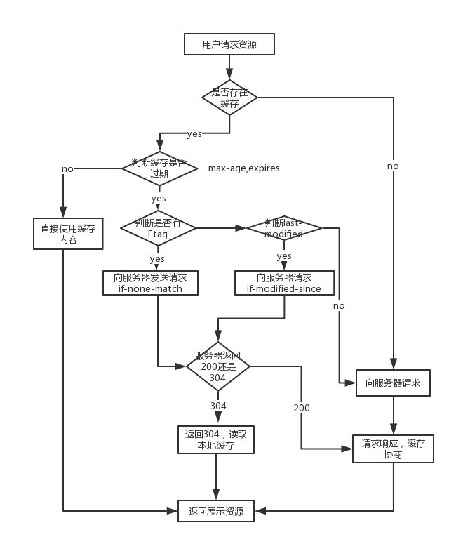
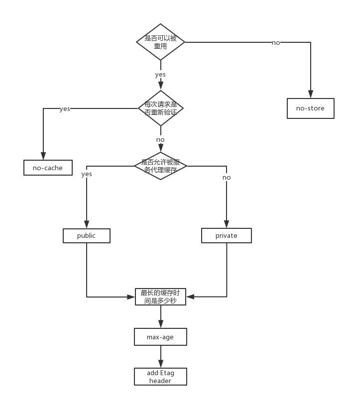

# 缓存

保存资源的副本，在下一次请求时直接使用该副本。从而减轻服务器的压力，减少获取资源的耗时，提升性能。

## 缓存分类

大致分为浏览器缓存和代理缓存。

## 浏览器缓存

缓存在用户的浏览器上，避免向服务器发送请求了，实现离线浏览。

## Cache-Control

定义缓存策略，在请求头/响应头都支持这个属性。

#### 禁止缓存

即使设置了Max-Age/Expires也无效。

Cache-Control: no-store

#### 共享缓存

可被浏览器、中间代理（中间代理、CDN）进行缓存

Cache-Control: public

#### 私有缓存

只能是浏览器缓存（默认）

Cache-Control: private

#### 强制验证

每次有请求发出，都会携带缓存的相关信息，经服务器确认。服务器验证缓存是否过期，没过期则返回304，浏览器直接使用本地缓存；过期了则下发新的资源. no-cache表示要缓存验证

Cache-Control: no-cache

#### 设置过期时间

单设缓存时间，表示强缓存。没超过缓存时间，用户直接使用缓存；过了缓存时间，会向服务器请求新的资源。

``` js
缓存过期时间。是距离当前时间多少秒数。

Cache-Control: max-age=31536000
```

``` js
s-maxAge=\<seconds>

覆盖max-age 或者 Expires（http 1.0） 头，但是仅适用于共享缓存。
```

#### 缓存验证

``` js
无论是否过期，在每次使用缓存之前都要到验证。

Cache-Control: max-age=31536000, no-cache
```

``` js
当缓存过期之后，就去去服务器验证，避免使用就缓存。和单独设置max-age/expires一样的效果。

Cache-Control: max-age=31536000, immutable/must-revalidate
```

``` js
与must-revalidate作用相同，但它仅适用于共享缓存。

proxy-revalidate
```

#### 验证方式

验证资源是否过期，未过期则直接使用缓存；过期则延长缓存时间/重新下发文件。有的文件不改变，但是又不想平凡的设置缓存时间，因此一般设置缓存为1年。

``` js
基于数字签名的认证方式，对资源的内容有唯一的签名，比如hash码。

Etag/If-None-Match
```

``` js
基于内容上次修改时间的认证方式。

Last-Modified/If-Modified-Since
```

`Etag` 的优先级高于 `Last-Modified`。

#### 禁止中间代理修改资源

中间代理可以对图像格式进行转换，以便节省缓存空间或者减少缓慢链路上的流量。

通过设置no-transform禁止中间代理修改：`Content-Type`、`Content-Encoding`、`Content-Range`等有关资源的headers。

``` js
  Cache-Control: public, max-age=31536000, no-transform
```

## 缓存思路图





#### 学习链接

- [MDN 缓存](https://developer.mozilla.org/zh-CN/docs/Web/HTTP/Caching_FAQ)
