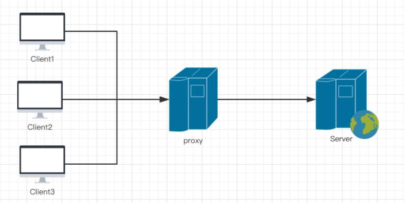
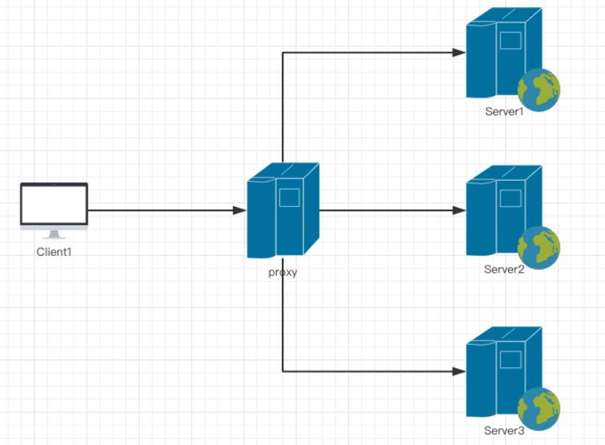

## 正向代理

为客户端代理。中间代理服务器作为一个媒介，代理用户的请求到服务端，拿到服务端返回的结果后，再将结果返回给用户的行为叫做正向代理。

因为权限等原因，用户不能直接访问 `server`。索引中间代理就出来了。

#### 正向代理的用处

- 翻墙

## 反向代理

为服务器代理。中间代理服务器接收用户请求，中间代理服务器决定去把请求发送到哪个服务器去。

如上图：如果用户想要访问 `server1`,通过中间服务器代理，可以让 `server2 / server3` 为用户提供服务。

#### 反向代理用处

- 安全，因为中间代理服务把原始服务隐藏掉了。

- 跨域

- 压缩

- 负载均衡：多个中间代理服务器构成的服务器集群。假如只有一个中间代理服务器并且发生了故障，就产生了单点故障，服务停止。此时就应使用多个中间代理服务器去代理不同服务。

- 缓存等

## 正向代理、反向代理异同

同：中间代理服务器都是用来接受请求、响应内容的。

异：

1. 正向代理中，中间代理伪装用户去请求服务器。

2. 反向代理中，用户以为访问的是真正的服务器，其实是中间代理把客户端的请求被转发到其他服务上。
