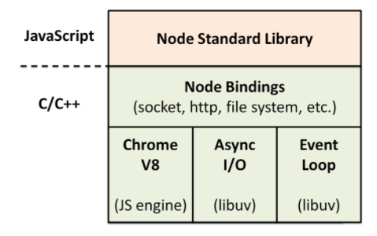

# node 简介

基于 chrome V8 引擎的 javascript 服务端运行环境。

## node 的主要特点

轻量、高效

事件驱动：通过监听事件状态的变化，来执行相关操作。比如：node 读文件，文件读取完成/未找到文件/文件读取错误都会触发对应状态，然后调用相关回调。

异步 I/O：针对 I/O 采用不阻塞操作。当线程遇到 I/O 操作时，不会等待 I/O 处理完成、拿到数据，而只是将 I/O 请求告知操作系统，继续执行下面的代码。当操作系统完成 I/O 操作后，以事件的形式通知执行 I/O 操作的线程，线程就会在空闲时处理这个事件。

## node 作用

做中间层：接口转发、权限控制、缓存代理等。

开发实用工具：例如webpack、gulp 实用工具库。

包管理工具：node 自带的 npm 包管理工具，能直接安装使用第三方包。

## node 基本原理

> Chrome V8 解释并执行 JavaScript 代码。

> libuv 由事件循环和线程池组成，负责所有 I/O 任务的分发与执行。

> Node.js Bindings 层将 Chrome V8 暴露的 C/C++ 接口转成 JavaScript Api，并且结合这些 Api 编写了 Node.js 标准库。

