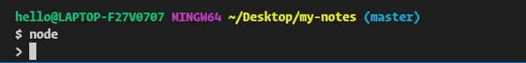

# repl解释器

node 自带的交互式解释器 repl，用来提供一个测试少量 js 代码的环境。在命令行输入 node 后，即可进入 repl：

可进行简单运算：

    $ node
    > 1 +4
    5
    > 5 / 2
    2.5

也可以定义变量：

    $ node
    > const arr = []
    undefined
    > arr.push(1)
    1
    > arr
    [ 1 ]

可多行输入（先输入一个 {，再换行）：

    $ node
    > for (let i = 0; i < 10; ++i) {
    ... console.log(i);
    ... }
    0
    1
    2
    3
    4
    5
    6
    7
    8
    9
    undefined
    >

退出当前 repl: 

- 两次 ctrl + c 
- 输入 .exit
