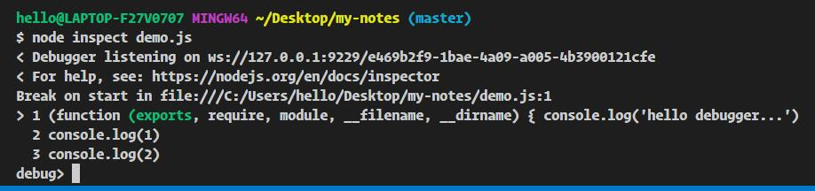
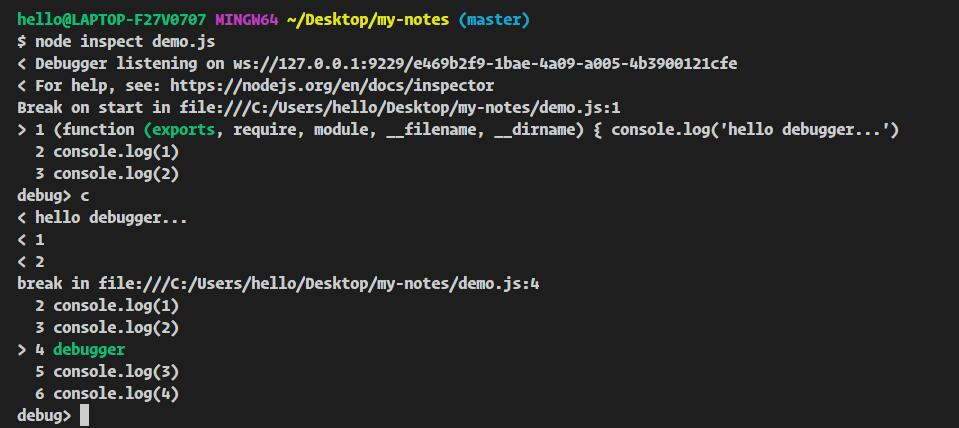
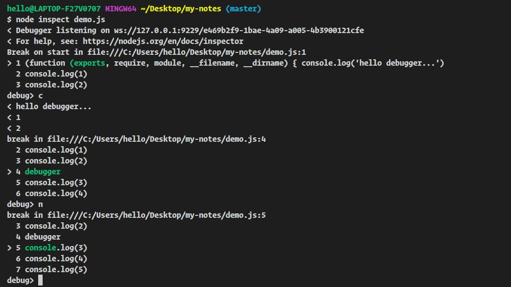
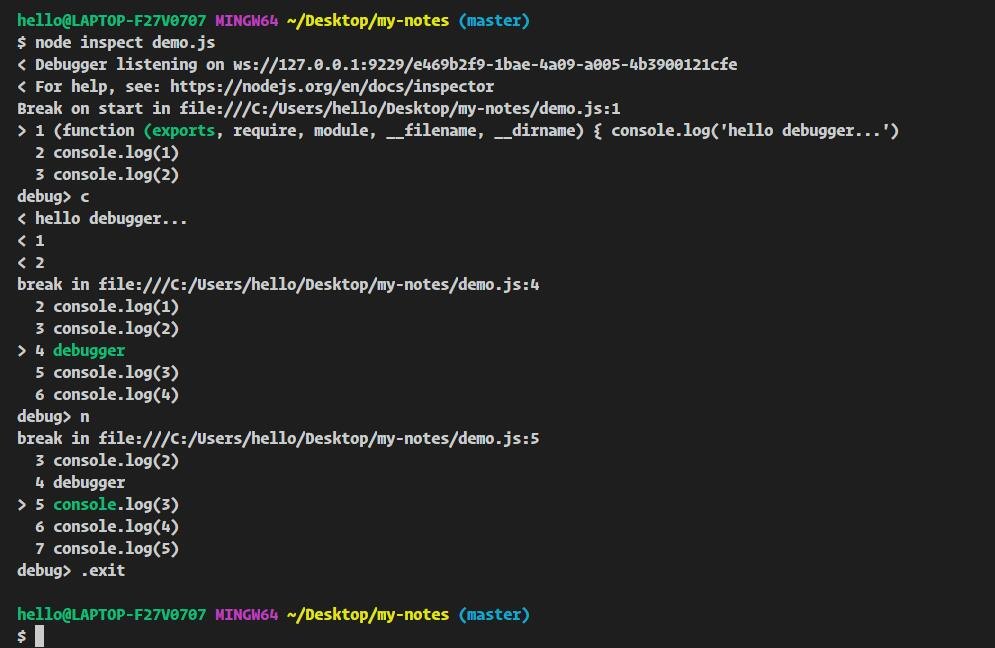

# 在命令行中使用调试器

node 开启 [debugger](http://nodejs.cn/api/debugger.html#debugger_debugger) ,调试脚本 demo.js:

``` js
console.log('hello debugger...')
console.log(1)
console.log(2)
debugger
console.log(3)
console.log(4)
console.log(5)
debugger
console.log(6)
```

使用 `node inspect demo.js` 开启调试：



输入 c (即：continue) 执行完当前代码片段，直至下一个断点（debugger）：



输入 n (即：next) 将光标调至下一行：



途中，可用 .exit 命令退出调试器。



除了上述调试以外，当 node 开启调试器时，也可以在浏览器上调试：


相关链接：
- [使用 node-inspector 调试 node 代码](https://github.com/node-inspector/node-inspector)
