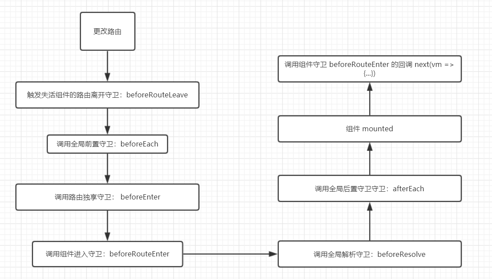

# 导航守卫

当前端路由发生跳转时，可以通过守卫可以是否允许跳转。

导航守卫分为三种：全局守卫、路由守卫、组件守卫。

## 全局守卫

用来监测所有的前端路由。

全局守卫分为三种：全局前置钩子 beforeEach、全局解释守卫 beforeResolve、全局后置钩子 afterEach

    router.beforeEach((to, from, next) => {
      next()
    })

    router.beforeEach((to, from, next) => {
      next()
    })

    // 没有 next 函数
    router.beforeEach((to, from) => {
      
    })

全局守卫的例子：nprogress 为每个页面提供加载进度

    yarn add nprogress

    // main.js
    import 'nprogress/nprogress.css'

    // router/index.js
    import nprogress from 'nprogress'

    router.beforeEach(() => {
      nprogress.start()
      next()
    })

    router.afterEach(() => {
      nprogress.done()
    })

## 路由独享守卫

在每个路由配置项上的守卫（因为只有一个钩子，所以叫独享...）：

    {
      path: '/',
      name: 'home',
      component: () =>  import(/* webpackChunkName: 'home' */ '@/pages/home/Home.vue'),
      beforeEnter (to, from, next) {
        next()
      }
    }

## 组件内的守卫

在每个 vue 文件的选项对象上配置的守卫：beforeRouteEnter、beforeRouteUpdate、beforeRouteLeave

    // 进入该组件的路由时调用
    beforeRouteEnter (to, from, next) {
      console.log('/ beforeRouteEnter...')
      next(vm => {
        console.log('/ 组件独享守卫的回调，需要等实例 vm 创建并挂载 DOM 上...')
      })
    },

    // 在当前路由改变，但是该组件被复用时调用
    beforeRouteUpdate (to, from, next) {
      console.log('/ beforeRouteUpdate')
      next()
    },

    // 离开该组件的路由时调用
    beforeRouteLeave (to, from, next) {
      console.log('/ beforeRouteLeave...')
      next()
    }

**注意**：beforeRouteEnter 必须使用回调才能获得组件实例，其他两个则不需要（因为实例已创建）。

## 导航解析流程

